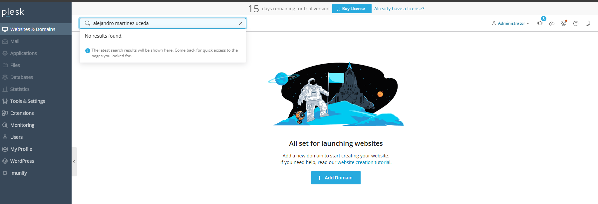
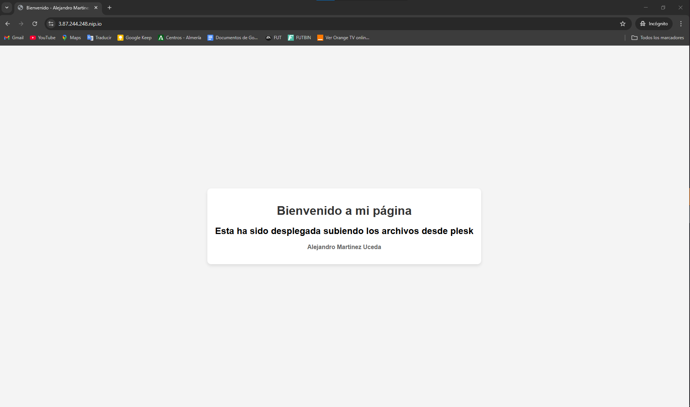
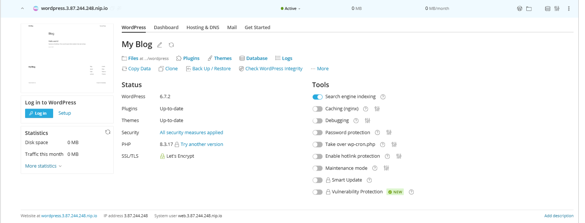
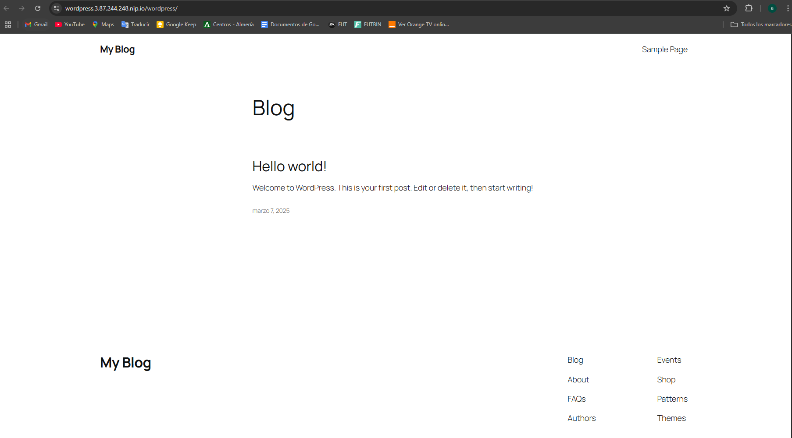

# **Despliegue de aplicaciones web con Plesk (Pagina web y Wordpress)**

En primer lugar deberemos de crear un grupo de seguridad llamado `sg_plesk` con los puertos `22` `80` y `443`, despues crearemos una instancia con `2vCPUs` `4GB RAM` y `30GB de almacenamiento` donde instalaremos un Ubuntu Server.

## Instalación de plesk
**Pasos para realizar la instalación desatendida de Plesk**
Como `root` o con un usuario con permisos de `sudo`, ejecute los siguientes comandos:

1. Descargue el script de instalación desatendida de Plesk.
~~~~
wget https://autoinstall.plesk.com/plesk-installer
~~~~
2. Le asignamos permisos de ejecución al script.
~~~~
chmod +x plesk-installer 
~~~~
3. Ejecutamos el script de instalación.
~~~~
./plesk-installer install plesk
~~~~
El proceso de instalación puede tardar unos **10 minutos**. Una vez que finalice el proceso de instalación le aparecerá un mensaje similar a este:
~~~
Congratulations!

The installation has been finished. Plesk is now running on your server.

To complete the configuration process, browse either of URLs:
   * https://frosty-antonelli.3.87.224.248.plesk.page/login?secret=rNECTAYl7gCSNhDCraxGuQD_ANbwMIeAP7JLtkUymSTChS5_
   * https://3.87.224.248/login?secret=rNECTAYl7gCSNhDCraxGuQD_ANbwMIeAP7JLtkUymSTChS5_

Use the username 'admin' to log in. To log in as 'admin', use the 'plesk login' command.
You can also log in as 'root' using your 'root' password.

Use the 'plesk' command to manage the server. Run 'plesk help' for more info.

Use the following commands to start and stop the Plesk web interface:
'systemctl start psa.service' and 'systemctl stop psa.service' respectively.

If you would like to migrate your subscriptions from other hosting panel
or older Plesk version to this server, please check out our assistance
options: https://www.plesk.com/professional-services/
~~~

Para completar el proceso de instalación habrá que acceder a una de las URLs que aparecen en el mensaje anterior. Cuando acceda le aparecerá un formulario donde puede configurar los siguientes parámetros:

- **Correo electrónico** del administrador.
- **Contraseña** del usuario admin.
- **Licencia**. En nuestro seleccionaremos la licencia de prueba que cuenta con todas las opciones disponibles durante un período de **15 días**.

**Una vez hecho esto ya tendriamos la instalación de plesk finalizada en nuestro servidor**

## Despliegue de una aplicación subiendo los archivos desde el panel de control

En este ejemplo vamos a dar de alta un dominio con el siguiente formato:
~~~~
3.87.224.248.nip.io
~~~~
Paso 1. Seleccionamos la opción `Websites & Domains` y hacemos clic en el botón `Add Domain`.

Paso 2. Para indicar que vamos a desplegar un sitio web subiendo los archivos desde nuestra máquina local, seleccionamos la opción `Upload files`.

Paso 3. Indicamos el nombre del dominio que quereos añadir. Tenga en cuenta que Plesk añadirá automáticamente el prefijo `www`.

Paso 4. Si queremos que los usuarios sean redirigidos automáticamente al dominion sin `www`, accedemos a la sección `Hosting & DNS` y seleccionamos la opción `Hosting`.

Paso 5. En el desplegable que aparece en la opción `Preferred domain` seleccionamos cuál será nuestro dominio preferido.

Paso 6. Para subir los archivos de la aplicación web seleccionamos la opción `Get Started` y dentro de esta sección seleccionamos la opción `Upload Files`.

Paso 7. Nos aparecerá el arbol de directorios del servidor y dentro del directorio `httpdocs` subiremos los archivos de la aplicación web.

Paso 8. Para subir nuevos archivos pinchamos sobre el botón con el icono del `+` y nos aparecerá un menú con varias opciones.

Paso 9. Una vez que hayamos subido nuestros archivos, accederemos desde otra pestaña del navegador al dominio que hemos dado de alta en Plesk.

Paso 10. Podemos observar que nuestro sitio sólo está disponible por `HTTP`. Vamos a solucionarlo solicitando un certificado SSL gratuito a Let’s Encrypt.

Selecionamos en el menú de la izquierda la opción Websites & Domains y en la sección Dashboard seleccionamos la opción `SSL/TLS Certificates`.

Paso 11. Seleccionamos la opción `Install a free basic certificate provided by Let's Encrypt` al final de la pagina.

Paso 12. Indicamos que vamos a solicitar un certificado para nuestro dominio.

Paso 13. Una vez que haya finalizado el proceso de instalación del certificado, podemos acceder a nuestro sitio web por `HTTPS`.

## Despliegue de Wordpress
En este ejemplo vamos a dar de alta un subdominio con el siguiente formato:
~~~~
wordpress.3.87.224.248.nip.io
~~~~
Plesk dispone de la utilidad `WP Toolkit` que permite instalar, configurar y administrar WordPress de una forma sencilla.

En esta práctica tendrá que crear el subdominio y desplegar una aplicación WordPress.

Una vez que haya realizado la instalación de WordPress, tendrá que aplicar las medidas de seguridad recomendadas por Plesk para proteger la aplicación.

